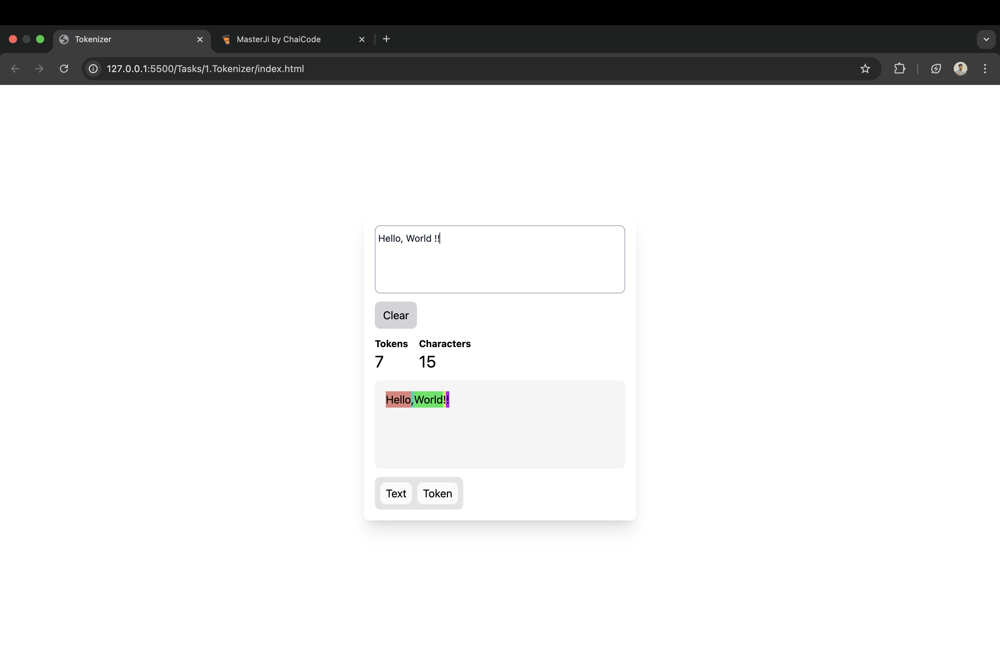
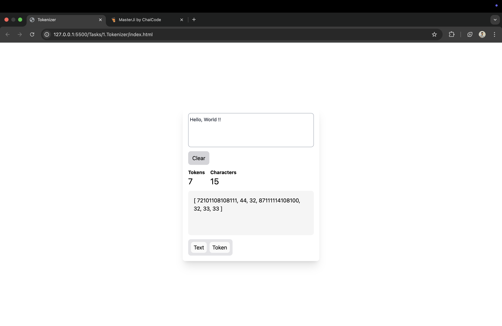

# GENAI-JS

#All the Tasks or Assignments are in Tasks Folder

# 1. Custom Tokenizer Assignment

   Simple Html File can be run on Live Server, Script is in the HTML File itself

On clicking Text Button (Default)
    

On clicking Token Button
   

# 2. Persona AI

React Application Deployed on Vercel. 
Link : https://2-persona-ai.vercel.app/

Github Folder Path : Task -> 2.PersonaAI